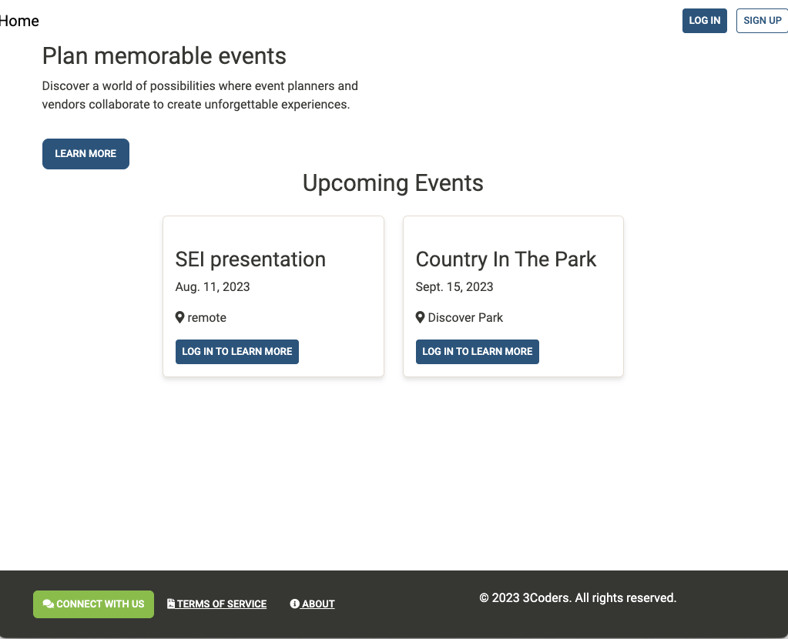
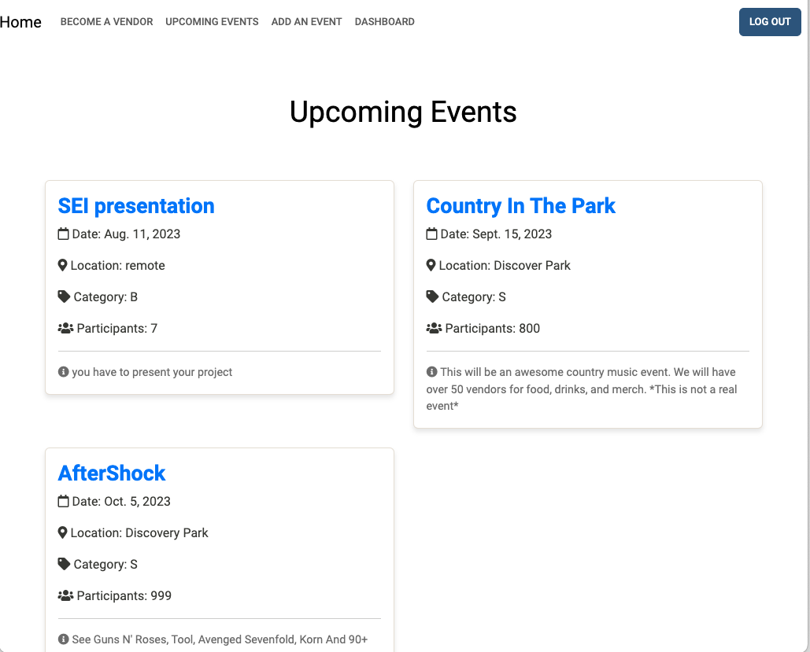
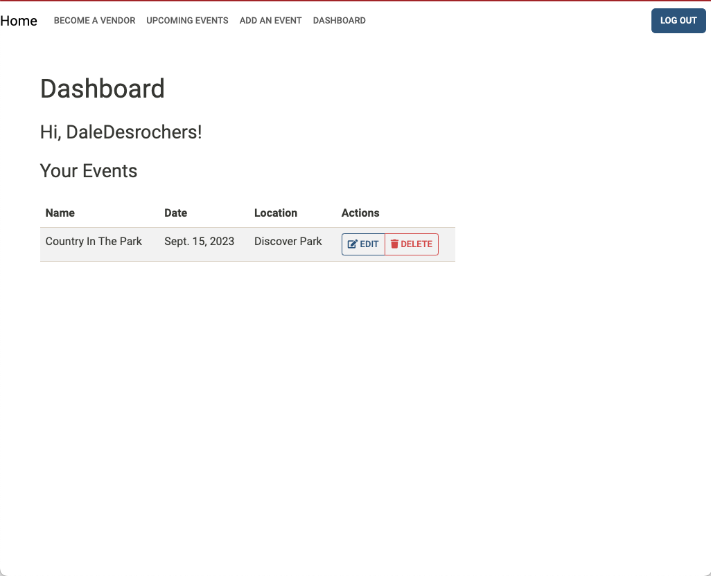

# EventPro

EventPro is an innovative event planner web application built on the Django framework, designed to efficiently manage all aspects of event planning and organization. This platform empowers event organizers by centralizing activity management and providing easy access to vendor contact details, ensuring seamless event coordination.

## Features

- User-friendly sign-up and login system to access the application.
- Comprehensive dashboard displaying all upcoming events.
- Intuitive event creation and management capabilities.
- Effortlessly add vendors to events to streamline collaboration.
- Interactive commenting system to facilitate communication about events.
- User-created events are fully editable and removable.
- Restricted CRUD (Create, Read, Update, Delete) operations on event data for authorized users.

## Screenshots

## Technologies Used

- Django
- Python
- PostgreSQL
- HTML
- CSS

## Getting Started

Get started with EventPro by visiting the application at: [EventPro App](https://eventpro-74856-ccdd70a7f67a.herokuapp.com/)

## Project Management

Stay updated with the project's progress and tasks on our [Trello Board](https://trello.com/b/OKOEHVgo/event-planner).

## Project Presentation

Learn more about EventPro's features and development process through our [Google Presentation](https://docs.google.com/presentation/d/1Ss4YYHW8K-RC3jIvLvi6cGgX6zONdHQV55XTkQUQLBY/edit?usp=sharing).

## Next Steps

We have exciting plans for the future of EventPro, including:

- Adding a status field for events, indicating whether they are scheduled or completed.
- Implementing a vendor rating system to enhance user experience and feedback.

Join us on this journey as we continue to evolve and improve EventPro!

---

